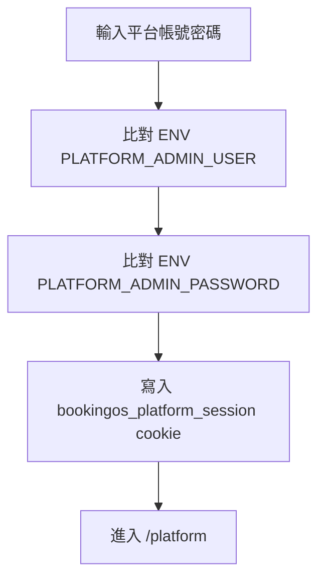
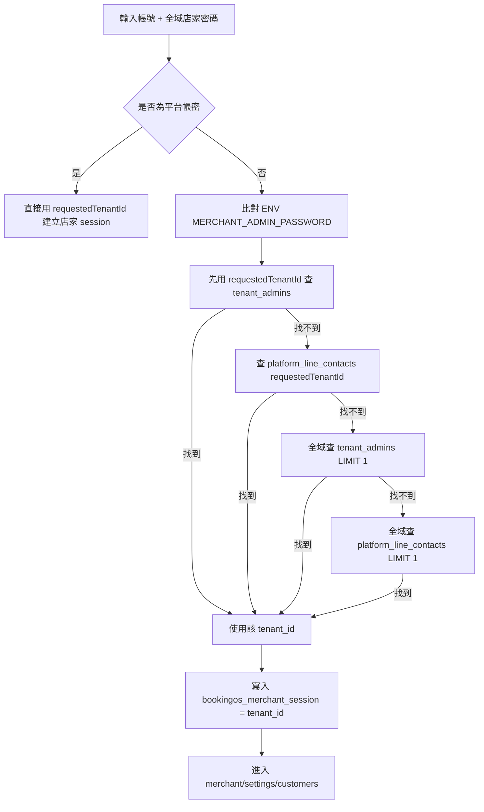
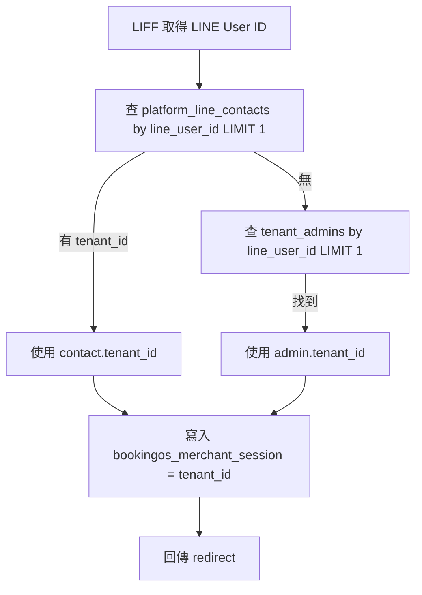
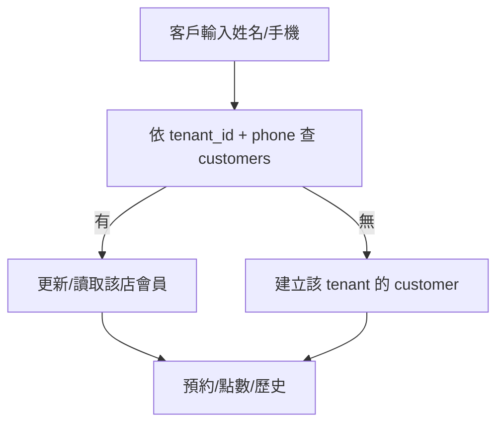
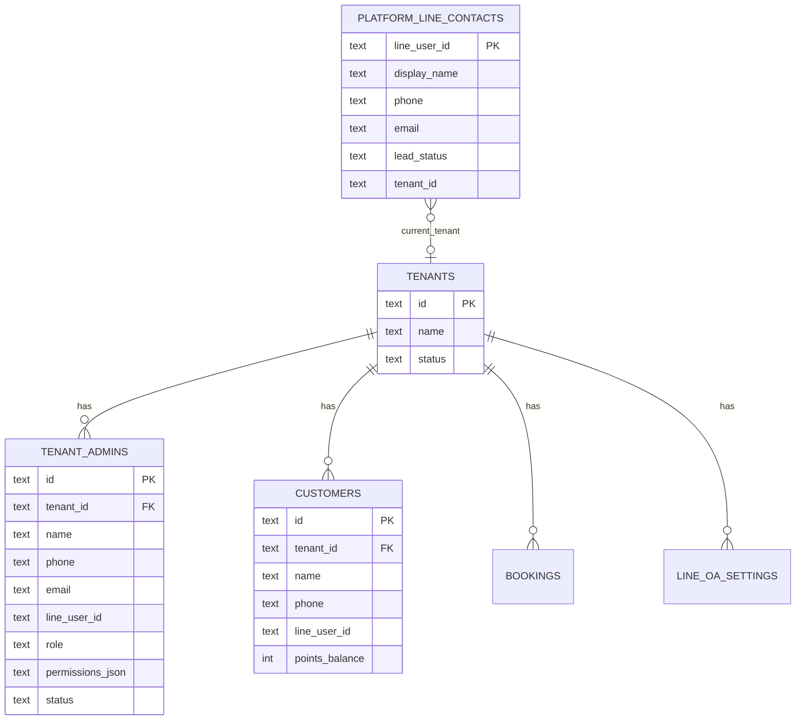
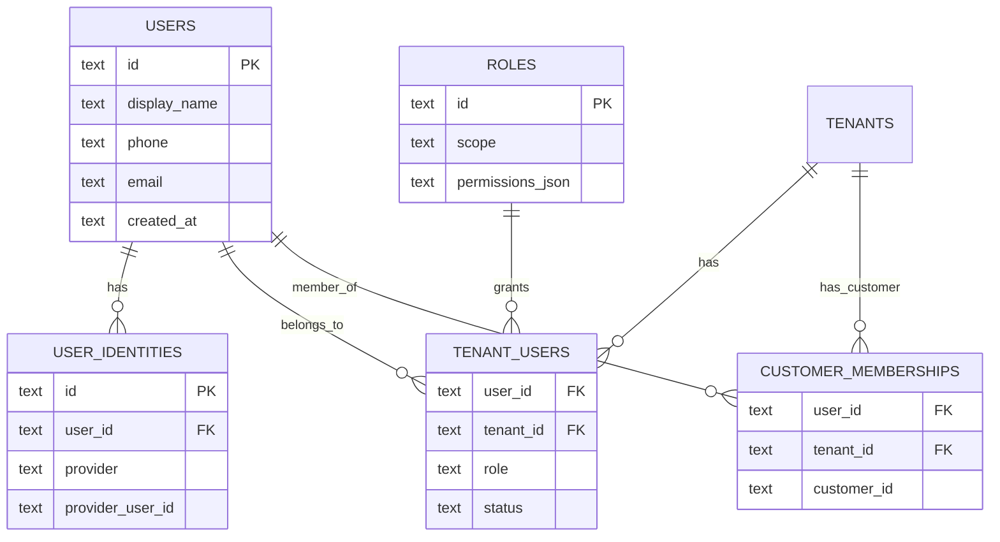
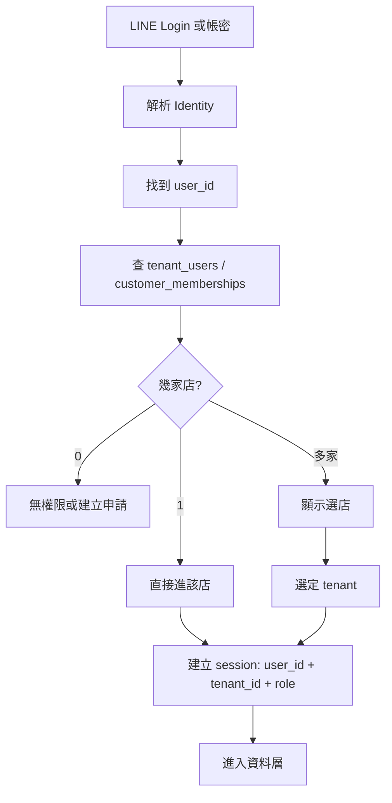

# Identity Audit

日期：2026-07-10
範圍：`src/index.js`、`migrations/*.sql`、遠端 D1 schema
狀態：唯讀稽核，沒有修程式、沒有改資料表。

## AIWE Rule

Identity 優先於 Tenant。

順序必須是：

```text
Identity -> Tenant -> Permission -> Data
```

不是：

```text
Tenant -> Identity
```

原因：同一個人未來可能同時是多家店的老闆、管理者、設計師、師傅或客戶。系統必須先確認「這個人是誰」，再決定「他這次要進哪一家店」，最後才判斷權限與資料範圍。

## 目前 Schema 摘要

### 沒有獨立 users 表

目前沒有：

- `users`
- `tenant_users`
- `roles`
- `sessions`

目前身份分散在：

| 表 | 用途 | 身份欄位 | tenant 關係 |
| --- | --- | --- | --- |
| `tenant_admins` | 店家後台管理者 | `name`, `phone`, `email`, `line_user_id`, `role` | 每列都有 `tenant_id` |
| `customers` | 店家客戶/會員 | `name`, `phone`, `line_user_id` | 每列都有 `tenant_id` |
| `platform_line_contacts` | 加入 BookingOS 平台官方 LINE 的店家線索/業主 | `line_user_id`, `display_name`, `phone`, `email` | 可選 `tenant_id`，但 `line_user_id` 是主鍵 |
| ENV secrets | 平台/店家密碼 | `PLATFORM_ADMIN_*`, `MERCHANT_ADMIN_PASSWORD` | 不屬於任何資料表 |

### tenant_admins 實際欄位

遠端 D1 目前 `tenant_admins` 欄位：

- `id`
- `tenant_id`
- `name`
- `phone`
- `email`
- `line_user_id`
- `role`
- `permissions_json`
- `status`
- `last_login_at`
- `created_at`
- `updated_at`

重點：沒有 `password` 欄位。店家帳密登入使用同一組全域 `MERCHANT_ADMIN_PASSWORD`，帳號用 `tenant_admins.phone/email/name` 或 `platform_line_contacts` 反查。

## 1. 目前登入到底有哪些方式？

### A. 平台總後台帳密登入

入口：

- `GET /platform-login`
- `POST /platform-login`

流程：



特性：

- 不查 DB user。
- 不知道是哪個 `user_id`。
- 不知道 `role`。
- Session 只是固定 secret。
- 進入平台後視為最高權限。

### B. 店家後台帳密登入

入口：

- `GET /merchant-login?tenant=...`
- `POST /merchant-login`

目前流程：



風險：

- 全域 fallback 使用 `LIMIT 1`。
- 如果 Tony 同時是店 A、店 B、店 C 管理者，現在不會顯示選店，而是挑到第一筆。
- 密碼不是每個 admin 自己的密碼，是全店家共用的 ENV 密碼。
- Session 只存 tenant，不存 user，也不存 role。

### C. 店家後台 LIFF 登入

入口：

- `POST /api/merchant/liff-login`

目前流程：



風險：

- `platform_line_contacts.line_user_id` 是主鍵，所以平台好友 CRM 一個 LINE 目前只能直接掛一個 `tenant_id`。
- `tenant_admins.line_user_id` 沒有全域唯一限制，可以同 LINE 出現在多 tenant，但登入時 `LIMIT 1`。
- 沒有選店頁。
- 沒有把 `role` 放入 session。

### D. 客戶端會員/預約身份

入口：

- `/book?tenant=...`
- `/member?tenant=...`
- `/points?tenant=...`
- `/history?tenant=...`
- `/api/member`
- `/api/customer-profile`
- `/api/bookings`

目前流程：



特性：

- 客戶會員目前主要靠 `tenant_id + phone`。
- `customers.line_user_id` 欄位存在，但目前客戶端沒有完整 LINE Login 綁定流程。
- 沒有客戶 session；多數動作靠手機查詢或送出。
- 同一 LINE/手機可以在不同 tenant 各有一筆 customer，schema 支援。

### E. 平台官方 LINE 好友身份

入口：

- `/platform-line-webhook`
- `/refer`
- `/api/referrals/claim`

用途：

- 記錄加入 BookingOS 官方 LINE 的店家線索/業主。
- 不是店家客戶會員。
- `platform_line_contacts.line_user_id` 是主鍵，一個 LINE 只有一筆平台好友資料。
- 可用 `tenant_id` 標記此人目前歸屬哪一家店，但不支援一個平台好友同時綁多店。

## 2. 目前 Session 存哪些欄位？

| Session | Cookie | 目前存放內容 | 是否有 user_id | 是否有 tenant_id | 是否有 role | 評估 |
| --- | --- | --- | --- | --- | --- | --- |
| 平台總後台 | `bookingos_platform_session` | `PLATFORM_SESSION_SECRET` 固定值 | 否 | 否 | 否 | 只代表通過平台密碼 |
| 店家後台 | `bookingos_merchant_session` | `encodeURIComponent(tenantId)` | 否 | 是，只有 tenant | 否 | 不知道登入者是誰，也不知道 role |
| 客戶端會員 | 無正式 session | 手機/表單資料 | 否 | 由 URL 決定 | 否 | 沒有登入態 |
| LIFF 登入 | 最終仍寫 merchant cookie | `tenantId` | 否 | 是，只有 tenant | 否 | LINE user ID 沒進 session |

結論：目前 Session 不符合目標模型。

目標應是：

```json
{
  "user_id": "...",
  "tenant_id": "...",
  "role": "owner|admin|staff|viewer|member"
}
```

目前只有：

```json
{
  "tenant_id": "..."
}
```

或平台：

```json
{
  "platform_secret_matched": true
}
```

## 3. 目前一個人最多可以幾家店？

### Schema 上

| 身份來源 | 是否支援一人多店 | 原因 |
| --- | --- | --- |
| `tenant_admins` by phone/email/name | 支援，但沒有正確登入 UX | 同一 phone/email/name 可以出現在多筆不同 tenant，沒有 unique 限制 |
| `tenant_admins` by line_user_id | 支援，但登入會錯 | 沒有 unique 限制，但目前 `LIMIT 1` |
| `customers` by phone | 支援 | `UNIQUE (tenant_id, phone)`，不是全域 unique |
| `customers` by line_user_id | 支援 | `UNIQUE (tenant_id, line_user_id)`，不是全域 unique |
| `platform_line_contacts` | 不支援真正多店 | `line_user_id` 是主鍵，只有一個 `tenant_id` 欄位 |

### 實際遠端資料上

本次讀取遠端 D1 檢查：

- `tenant_admins.phone` 跨多店：目前 0 筆。
- `tenant_admins.line_user_id` 跨多店：目前 0 筆。
- `customers.phone` 跨多店：目前 0 筆。
- `customers.line_user_id` 跨多店：目前 0 筆。

所以：目前資料沒有發生一人多店，但 schema 已經允許部分情境發生；登入流程還沒準備好。

## 4. 如果三家店，登入哪一家？

目前答案：系統不會問，會自動挑一筆。

### 店家帳密登入

優先順序：

1. 如果表單帶 `tenant`，先查該 tenant 的 `tenant_admins`。
2. 查不到，查該 tenant 的 `platform_line_contacts`。
3. 還查不到，全域查 `tenant_admins LIMIT 1`。
4. 還查不到，全域查 `platform_line_contacts LIMIT 1`。

因此如果 Tony 同時屬於三家店：

- 有帶 tenant 且該 tenant 命中：登入該 tenant。
- 沒帶 tenant 或 requested tenant 沒命中：資料庫回哪筆，就進哪家。
- 使用者不會看到「請選擇登入店家」。

### 店家 LIFF 登入

優先順序：

1. 查 `platform_line_contacts` 的 `line_user_id LIMIT 1`，有 tenant 就用它。
2. 否則查 `tenant_admins.line_user_id LIMIT 1`。

因此如果 LINE UID 同時屬於三家店：

- 目前不會列出三家。
- 會自動使用第一筆查詢結果。
- 這正是目前 Identity Model 最大缺口。

## 目前身份模型圖



目前模型其實是：

```text
Tenant -> tenant_admins / customers
```

不是：

```text
Identity -> tenant_memberships -> tenant
```

## 建議 V2 方向，尚不執行

先不要急著改資料表，但模型應往這個方向收斂：



登入流程應變成：



## 本輪結論

1. 目前登入方式有：平台帳密、店家帳密、店家 LIFF、客戶手機會員、平台 LINE 好友 webhook。
2. 目前 session 不存完整身份，只存平台 secret 或 tenant id。
3. schema 部分支援一人多店，但沒有 users / membership 中介模型。
4. 如果一人三家店，現在不會選店，會用 requested tenant 或 `LIMIT 1` 自動決定。
5. 下一步不應先修某個 `LIMIT 1`，而是先決定 V2 Identity Model：`users -> identities -> tenant_users -> roles -> session`。