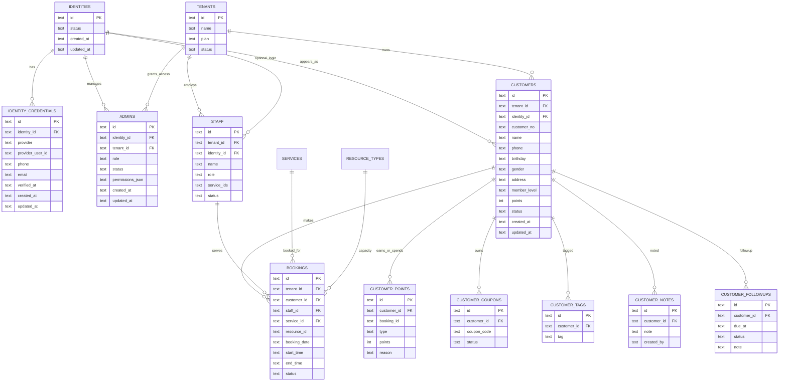
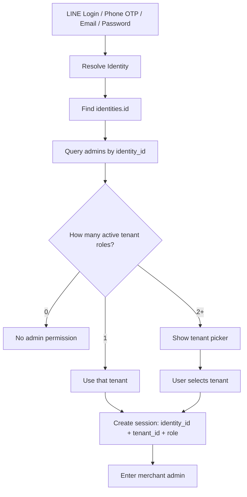
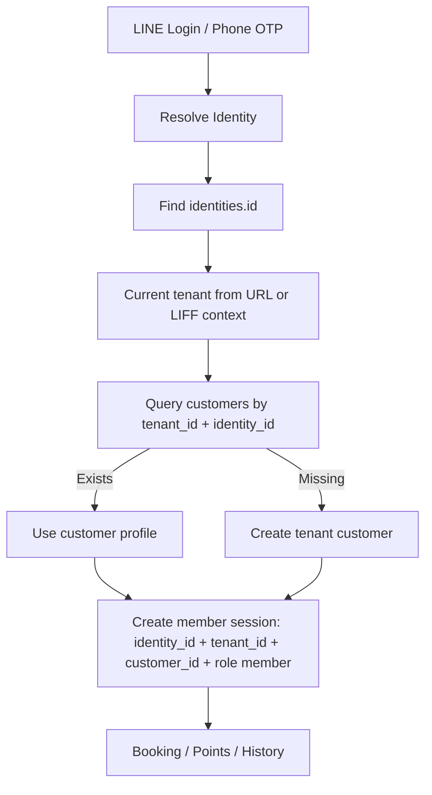

# BookingOS V1 Identity Model

日期：2026-07-10
狀態：設計確認文件，尚未執行 migration，尚未修改程式。

## 核心原則

Identity（平台身份）不等於 Customer（店家會員）。

- Identity 只回答：我是誰。
- Customer 只回答：我在這家店是什麼會員。
- Tenant 只回答：這是哪一家店。
- Permission 只回答：這個身份在這家店可以做什麼。
- Data 只回答：這家店自己的預約、CRM、點數、消費、備註。

Identity 永遠不存：

- 姓名
- 生日
- 地址
- 點數
- CRM 備註
- 消費紀錄
- 店家標籤
- 醫療/整復/髮色/美甲紀錄

這些全部屬於店家的 Customer 資料，不屬於平台 Identity。

## 企業級資料邊界

平台可以知道：

- 這個 identity 有哪些登入憑證。
- 這個 identity 關聯幾家店。
- 這個 identity 在每家店的角色。

平台不應知道或集中管理：

- 店家客戶的 CRM 備註。
- 看診/整復/髮色/美睫/美甲紀錄。
- 客戶在某店的生日、地址、偏好與消費。
- 點數、券、標籤、追蹤紀錄。

這些是各 tenant 自己的 customer data。

## V1 Target ER Diagram



## Login Flow

### Admin Login



### Customer Login



## Session Model

Session must contain at minimum:

```json
{
  "identity_id": "idn_...",
  "tenant_id": "tenant_...",
  "role": "owner|manager|staff|viewer|member",
  "expires_at": "2026-07-10T12:00:00Z"
}
```

For customer/member session, add:

```json
{
  "customer_id": "cus_..."
}
```

Do not use a session that only contains tenant.

## Why Identity Must Not Store Customer CRM

Example:

- Tony 在 A 店沒有留下生日。
- Tony 在 B 店填生日與地址。
- Tony 在 C 店是員工，不是客戶。

If Identity stores birthday/address/CRM, then B 店的資料 could leak into A 店 or platform. That violates SaaS privacy boundaries.

Therefore:

- Identity stores login identity only.
- Customer stores tenant-specific member data.
- Admin stores tenant-specific role.
- Staff stores tenant-specific staff profile, optionally linked to identity.