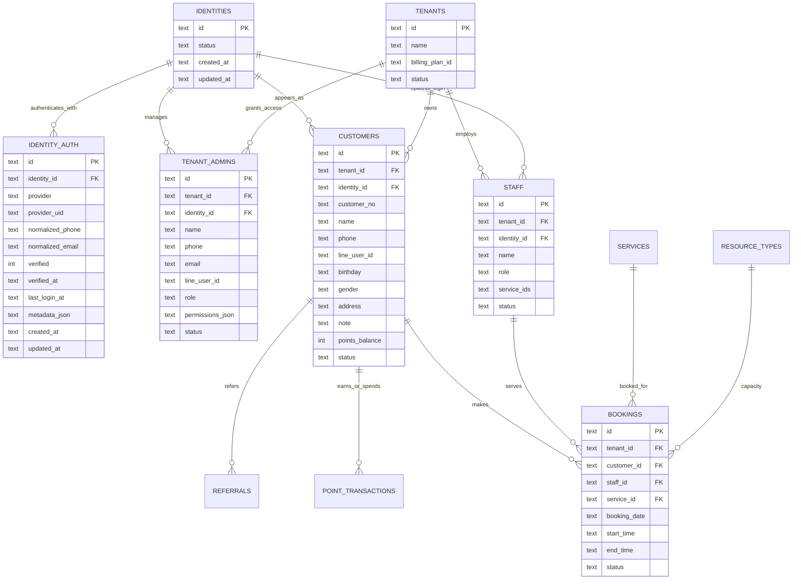
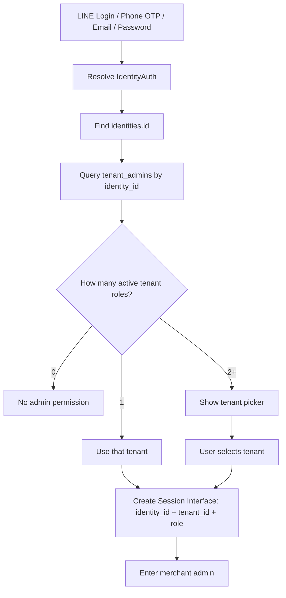
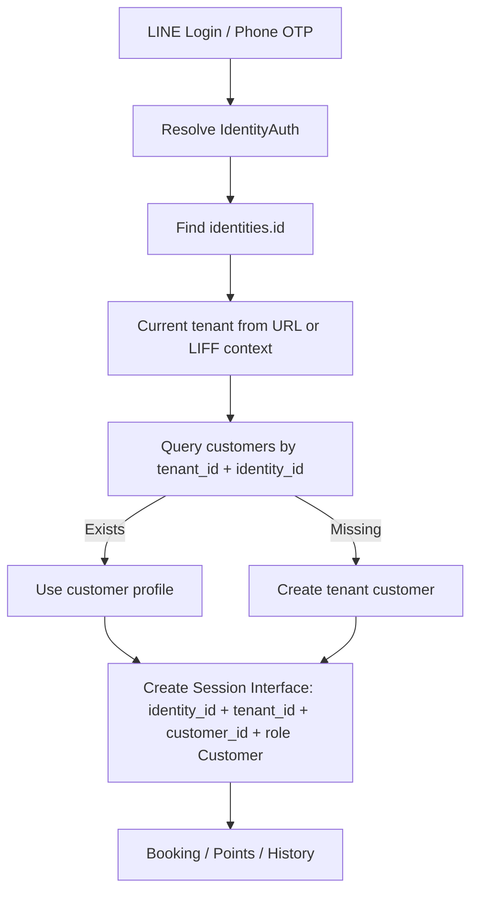

# BookingOS V1 Identity Model

日期：2026-07-10
狀態：Schema Freeze 文件，尚未執行 migration，尚未修改程式。

## 核心原則

Identity（平台身份）不等於 Customer（店家會員）。

- Identity 只回答：我是誰。
- IdentityAuth 只回答：我如何證明我是誰。
- Customer 只回答：我在這家店是什麼會員。
- TenantAdmin 只回答：這個身份在這家店有什麼管理角色。
- Tenant 只回答：這是哪一家店。
- Data 只回答：這家店自己的預約、CRM、點數、消費、備註。

Identity 永遠不存任何商業資料。

不得存入 Identity 的資料：

- 姓名
- 生日
- 地址
- 點數
- CRM 備註
- 消費紀錄
- 店家標籤
- 優惠券
- 病歷、整復紀錄、美髮紀錄、美甲/美睫紀錄

這些全部屬於店家的 Customer 資料，不屬於平台 Identity。

## V1 Schema Freeze

V1 凍結以下最小 schema：

- `identities`
- `identity_auth`
- `customers.identity_id`
- `tenant_admins.identity_id`

V1 不新增：

- `identity_profiles`
- 新的 `admins` 表
- `sessions` 表

原因：

- `identity_profiles` 現階段會讓 Identity 承擔顯示資料責任；LINE display name、avatar 等 provider snapshot 先放 `identity_auth.metadata_json`。
- 現有程式已大量依賴 `tenant_admins`，V1 直接在原表增加 `identity_id`，避免 `tenant_admins -> admins` 雙表 migration。
- Session 先凍結介面，不凍結儲存方式；後續可用 Signed Cookie、KV、Durable Object、JWT 或資料表實作。

## V1 Target ER Diagram



## Login Flow

### Admin Login



### Customer Login



## Session Interface

Session 必須對應出以下資料，但 V1 不指定儲存方式：

```json
{
  "identity_id": "idn_...",
  "tenant_id": "tenant_...",
  "role": "TenantOwner|TenantManager|Staff|Customer|PlatformOwner|PlatformAdmin",
  "expires_at": "2026-07-10T12:00:00Z"
}
```

Customer session 需額外對應：

```json
{
  "customer_id": "cus_..."
}
```

不可再使用只包含 tenant 的 session。

## Why Identity Must Not Store Customer CRM

例如：

- Tony 在 A 店沒有留下生日。
- Tony 在 B 店填生日與地址。
- Tony 在 C 店是員工，不是客戶。

如果 Identity 存生日、地址、CRM，B 店的資料就可能污染 A 店或平台資料。這違反 SaaS 資料邊界。

因此：

- Identity 只存穩定平台身份。
- IdentityAuth 存登入憑證與 provider profile snapshot。
- Customer 存 tenant-specific member data。
- TenantAdmin 存 tenant-specific role。
- Booking、Point、Coupon、CRM 全部指向 Customer，不指向 Identity。
