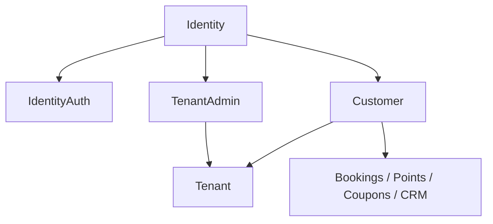
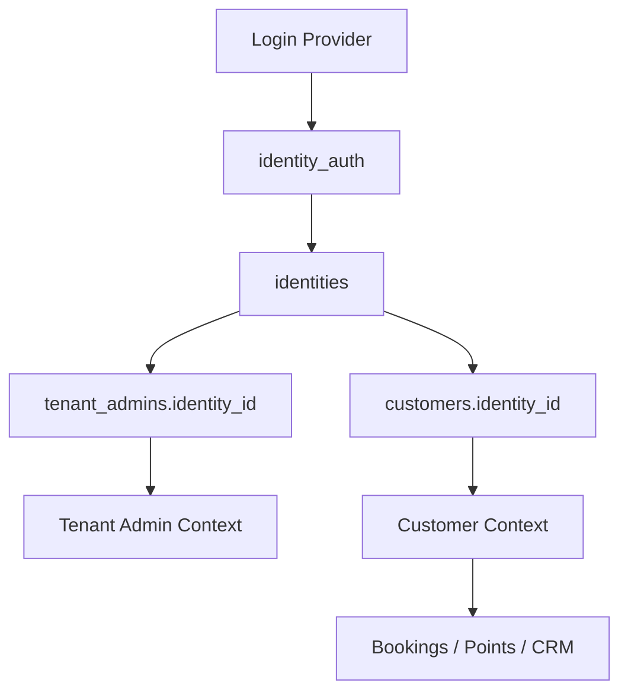

# BookingOS Identity Architecture Review

日期：2026-07-10
狀態：Reviewed and accepted with corrections。未修改程式、未修改資料庫、未建立 migration、未 deploy。

## 0. Final Review Decision

本 review 的最終採納版本如下：



V1 採用：

- `identities`
- `identity_auth`
- `tenant_admins.identity_id`
- `customers.identity_id`
- Session Interface

V1 不採用：

- `identity_profiles`
- 新 `admins` table
- `sessions` table

## 1. Architecture Impact

### 1.1 API dependency map

| API / Route | File | Current dependency | Reason | Future identity_id impact |
| --- | --- | --- | --- | --- |
| `POST /platform-login` | `src/index.js:353` | `account`, `password`, env session secret | Platform login uses env account/password and writes fixed platform cookie. | Yes. Future platform auth should resolve Identity through IdentityAuth or platform-specific auth, then return Session Interface. |
| `POST /merchant-login` | `src/index.js:387` | `phone`, `email`, `name`, `tenant_id`, platform secret | Merchant login uses global password and looks up `tenant_admins` / `platform_line_contacts`. | Yes. Resolve through `identity_auth`, then query `tenant_admins.identity_id`. |
| `POST /api/merchant/liff-login` | `src/index.js:432` | `line_user_id`, `tenant_id` | LIFF login receives LINE UID, then finds one tenant. | Yes. LINE UID should resolve through `identity_auth(provider='LINE')`, then tenant picker if multiple roles exist. |
| `GET /api/platform` | `src/index.js:201` | `tenant_id`, `phone`, `email`, `line_user_id` | Platform dashboard lists tenants/admins/contacts/applications/orders. | Yes. Platform should show `tenant_admins.identity_id` and IdentityAuth summary where needed. |
| `POST /api/applications` | `src/index.js:204` | `owner_phone`, `owner_email`, `owner_line_user_id` | Application stores owner contact and LINE lead. | Yes. Later link application owner to Identity/Auth after verified login or approval. |
| `POST /api/trials` | `src/index.js:207` | `owner_phone`, `owner_email`, `lineUserId`, `tenant_id` | Trial creates tenant and `tenant_admins` owner. | Yes. Create/link IdentityAuth, then write `tenant_admins.identity_id`. |
| `POST /api/platform/applications/approve` | `src/index.js:210` | `tenant_id`, `owner_phone`, `owner_email`, `owner_line_user_id` | Approval creates tenant admin owner. | Yes. Create/link IdentityAuth, then write `tenant_admins.identity_id`. |
| `POST /api/platform/admins` | `src/index.js:225` | `tenant_id`, `phone`, `email`, role | Creates `tenant_admins`. | Yes. Keep `tenant_admins`; add/link `identity_id`. Do not create `admins`. |
| `POST /api/referrals/claim` | `src/index.js:234` | `referrerLineUserId`, `referredLineUserId` | Referral links LINE UID to LINE UID. | Yes. Keep provider UID as evidence; later add Identity link when available. |
| `GET /api/dashboard` | `src/index.js:237` | `tenant_id` | Merchant dashboard loads tenant data. | Yes. Must be authorized through Session Interface. |
| `GET/POST /api/store` | `src/index.js:246` | `tenant_id` | Merchant edits store. | Yes. Must require Session Interface role/permission. |
| `GET/POST /api/settings` | `src/index.js:251` | `tenant_id` | Merchant edits rules. | Yes. Must require Session Interface role/permission. |
| `GET/POST /api/services` | `src/index.js:259` | `tenant_id` | Merchant edits services. | Yes. Must require Session Interface role/permission. |
| `GET/POST /api/staff` | `src/index.js:264` | `tenant_id`, staff role/permissions | Merchant edits staff list. | Partial. Staff identity is deferred; role access still uses TenantAdmin/Session Interface. |
| `GET /api/customers/export` | `src/index.js:274` | `tenant_id`, `customer_id`, phone/email | Merchant downloads Customer workbook. | Yes. Customer data remains Customer-owned; access must be permission-checked. |
| `GET /api/customers` | `src/index.js:277` | `tenant_id`, `customer_id`, phone | Merchant CRM list. | Yes. Can add `identity_id` for linkage, but CRM remains Customer. |
| `GET /api/customer-profile` | `src/index.js:281` | `phone`, `tenant_id` | Public/customer lookup by phone. | Yes. Future should use Customer session via IdentityAuth. |
| `GET/POST /api/member` | `src/index.js:285` | `phone`, `email`, `customer_id`, `tenant_id` | Member profile by phone. | Yes. Future lookup is `tenant_id + identity_id`; phone stays Customer field. |
| `POST /api/bookings/cancel` | `src/index.js:290` | `bookingId`, `phone`, `customer_id`, `tenant_id` | Cancel validates phone. | Yes. Future cancel should authorize by Customer session. |
| `POST /api/bookings` | `src/index.js:294` | `phone`, `customer_id`, `tenant_id`, `staff_id` | Booking creates/finds Customer by phone. | Yes. Logged-in flow should use `customer_id`; guest phone flow can remain transitional. |
| `POST /platform-line-webhook` | `src/index.js:1653` | `line_user_id`, platform OA profile | Platform LINE webhook upserts platform contacts. | Yes. Create/link `identity_auth`; provider display snapshot goes to `metadata_json`, not `identity_profiles`. |
| `GET /refer` | `src/index.js:1716` | `ref` LINE UID | Referral URL carries LINE UID. | Yes. Later prefer referral token or Identity link; no immediate schema beyond IdentityAuth. |

### 1.2 SQL impact

| SQL target | Current use | Future direction |
| --- | --- | --- |
| `tenant_admins` | Merchant login, platform admin list, trial/application/admin creation. | Keep table. Add nullable `identity_id`. Gradually stop using phone/email/line_user_id as primary auth. |
| `customers` | Member profile, booking, points, CRM export, history. | Keep table. Add nullable `identity_id`. Customer remains owner of CRM/business data. |
| `platform_line_contacts` | Platform LINE friend CRM, referral, lead status. | Keep as lead/contact table. Optionally add `identity_id`; do not use as long-term auth table. |

### 1.3 Session impact

| Session | Current | Frozen direction |
| --- | --- | --- |
| Platform Session | Cookie contains env secret. | Session Interface returns `identity_id`, `role=PlatformOwner/PlatformAdmin`, `expires_at`. Storage not frozen. |
| Merchant Session | Cookie contains tenant id only. | Session Interface returns `identity_id`, `tenant_id`, `role`, `permissions`, `expires_at`. Storage not frozen. |
| Customer Session | No formal session; phone lookup. | Session Interface returns `identity_id`, `tenant_id`, `customer_id`, `role=Customer`, `expires_at`. Storage not frozen. |
| LIFF Login | Resolves LINE UID to one tenant. | Resolve LINE UID through `identity_auth`, then tenant picker if multiple `tenant_admins` rows exist. |

## 2. Database Impact

### Immediate

| Type | Item |
| --- | --- |
| Table | `identities` |
| Table | `identity_auth` |
| Column | `customers.identity_id TEXT NULL` |
| Column | `customers.customer_no TEXT NULL` |
| Column | `tenant_admins.identity_id TEXT NULL` |
| Index | `idx_identity_auth_identity` |
| Unique Index | `identity_auth(provider, provider_uid)` where `provider_uid IS NOT NULL` |
| Unique Index | `identity_auth(provider, normalized_phone)` for PHONE |
| Unique Index | `identity_auth(provider, normalized_email)` for EMAIL |
| Index | `idx_tenant_admins_identity` |
| Unique Index | `customers(tenant_id, identity_id)` where `identity_id IS NOT NULL` |

### Deferred / Not Frozen

| Item | Decision |
| --- | --- |
| `identity_profiles` | Do not create in V1. Use `identity_auth.metadata_json` for provider snapshot. |
| New `admins` table | Do not create in V1. Keep `tenant_admins`. |
| `sessions` table | Do not create in V1. Freeze Session Interface only. |
| `staff_members.identity_id` | Deferred. |
| CRM split tables | Deferred. Customer owns CRM data. |

## 3. Identity Review

Final accepted model:

- Identity is stable platform account identity.
- IdentityAuth is login/authentication evidence.
- TenantAdmin is tenant-specific admin role.
- Customer is tenant-specific member/business profile.

Identity must remain empty of business data.

## 4. IdentityAuth Proposal

Accepted.

```sql
CREATE TABLE identity_auth (
  id TEXT PRIMARY KEY,
  identity_id TEXT NOT NULL,
  provider TEXT NOT NULL,
  provider_uid TEXT,
  normalized_phone TEXT,
  normalized_email TEXT,
  verified INTEGER NOT NULL DEFAULT 0,
  verified_at TEXT,
  last_login_at TEXT,
  metadata_json TEXT NOT NULL DEFAULT '{}',
  created_at TEXT NOT NULL DEFAULT (datetime('now')),
  updated_at TEXT NOT NULL DEFAULT (datetime('now')),
  FOREIGN KEY (identity_id) REFERENCES identities(id)
);
```

`metadata_json` may store provider snapshot such as LINE display name and picture URL. It must not store tenant CRM/business data.

## 5. Session Proposal

Accepted direction: Session Interface, not Session Table.

Required resolved fields:

- `identity_id`
- `tenant_id` when tenant-scoped
- `customer_id` when customer-scoped
- `role`
- `permissions`
- `expires_at`

Possible future storage:

- Signed Cookie
- KV
- Durable Object
- JWT
- D1 table, only if later proven useful

## 6. Permission Model

Accepted roles:

| Role | Scope | Can do |
| --- | --- | --- |
| `PlatformOwner` | Platform | Full platform operations. |
| `PlatformAdmin` | Platform | Tenant/application/order/LINE management, limited by permissions. |
| `TenantOwner` | Tenant | Full store operations and tenant admin management. |
| `TenantManager` | Tenant | Day-to-day operations, CRM, schedule, booking, services if granted. |
| `Staff` | Tenant | Own schedule/bookings and permitted CRM actions. |
| `Customer` | Tenant | Own booking, points, profile, history. |

Role is source of truth. `permissions_json` is override/extension only.

## 7. Migration Risk

### P0

| Risk | Mitigation |
| --- | --- |
| Wrong tenant selected by `LIMIT 1` | Identity login must show tenant picker when multiple `tenant_admins.identity_id` rows exist. |
| Customer data leak across tenants | Every Customer access remains `tenant_id + customer_id` or `tenant_id + identity_id`. |
| LINE UID becomes primary key | LINE UID only lives in `identity_auth.provider_uid`. |
| Session remains tenant-only | Build Session Interface before switching protected routes. |
| Bad identity merge | Only merge strong verified auth evidence; ambiguous phone/email needs manual review. |

### P1

| Risk | Mitigation |
| --- | --- |
| Duplicate Customer rows | Add `customers(tenant_id, identity_id)` unique index after cleanup. |
| Legacy phone member flow breaks | Keep phone fallback during transition. |
| TenantAdmin auth fields duplicate IdentityAuth | Keep old fields until login migration is proven, then deprecate. |

## 8. Recommended Architecture

Freeze this architecture before migration:



No further architecture review is needed before Schema Freeze. The next step is to use `SCHEMA_FREEZE.md` and `MIGRATION_CHECKLIST.md` as the migration gate.
