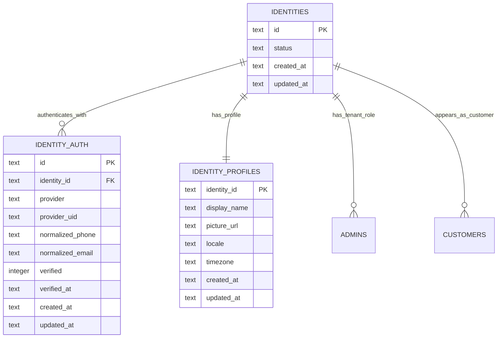
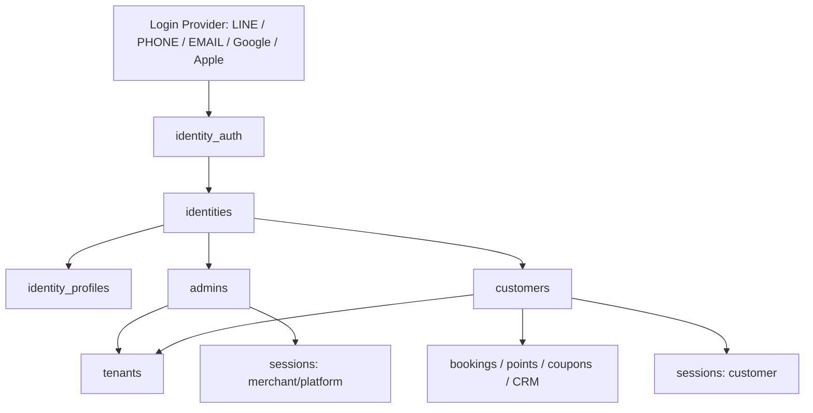

# BookingOS Identity Architecture Review

日期：2026-07-10
狀態：Architecture Review only。未修改程式、未修改資料庫、未建立 migration、未 deploy。

## 0. Review Scope

本次依據目前 Repository、`docs/IDENTITY_MODEL_V1.md`、`docs/IDENTITY_MIGRATION_PLAN.md` 進行審查。

限制：

- 不修改程式。
- 不修改資料庫。
- 不建立 migration。
- 不 deploy。
- 不重構。
- 不新增 API。
- 不修改 Session 或 Login。

本報告只回答 Identity Architecture 對目前系統的影響、風險與建議架構。

## 1. Architecture Impact

### 1.1 API dependency map

| API / Route | File | Current dependency | Reason | Future identity_id impact |
| --- | --- | --- | --- | --- |
| `POST /platform-login` | `src/index.js:353` | `account`, `password`, env session secret | Platform login uses env account/password and writes fixed platform cookie. | Yes. Future platform login should resolve `identity_id`, then `platform_roles`, then session. |
| `POST /merchant-login` | `src/index.js:387` | `phone`, `email`, `name`, `tenant_id`, platform secret | Merchant login uses global password and looks up `tenant_admins` / `platform_line_contacts` by phone/email/name. | Yes. Replace with `identity_auth` credential lookup, then `admins WHERE identity_id = ?`. |
| `POST /api/merchant/liff-login` | `src/index.js:432` | `line_user_id`, `tenant_id` | LIFF login receives LINE UID, then finds one tenant from `platform_line_contacts` or `tenant_admins`. | Yes. LINE UID should resolve to `identity_auth`, then list available admin tenants. |
| `GET /api/platform` | `src/index.js:201` | `tenant_id`, `phone`, `email`, `line_user_id` | Platform dashboard lists tenants, tenant admins, platform contacts, applications, orders. | Yes. Platform should show admin/customer linkage through `identity_id`; LINE UID should no longer be primary. |
| `POST /api/applications` | `src/index.js:204` | `owner_phone`, `owner_email`, `owner_line_user_id` | Formal application stores owner contact and syncs platform LINE lead. | Yes. Application should optionally create or link Identity/Auth after approval or verified login. |
| `POST /api/trials` | `src/index.js:207` | `owner_phone`, `owner_email`, `lineUserId`, `tenant_id` | Trial creation immediately creates tenant and `tenant_admins` owner. | Yes. Should create tenant, identity, identity_auth, admin role in one controlled flow. |
| `POST /api/platform/applications/approve` | `src/index.js:210` | `tenant_id`, `owner_phone`, `owner_email`, `owner_line_user_id` | Approval creates tenant and `tenant_admins` owner. | Yes. Approval should create/link Identity, then create `admins`. |
| `POST /api/platform/tenants` | `src/index.js:222` | `tenant_id`, store phone | Manual tenant creation creates tenant only. | Partial. Tenant itself remains separate, but owner assignment should use Identity in later admin creation. |
| `POST /api/platform/admins` | `src/index.js:225` | `tenant_id`, `phone`, `email`, role | Creates rows in `tenant_admins`. | Yes. Should create/link Identity/Auth, then create `admins(identity_id, tenant_id, role)`. |
| `POST /api/platform/platform-line-oa` | `src/index.js:228` | Platform LINE settings, no person identity | Saves platform OA credentials. | No direct identity change, but LINE Login settings should be tied to `identity_auth` provider config. |
| `POST /api/platform/line-oa` | `src/index.js:231` | `tenant_id` | Saves tenant-specific LINE OA settings. | No direct identity change, but tenant LINE Login should produce `identity_auth` rows. |
| `POST /api/referrals/claim` | `src/index.js:234` | `referrerLineUserId`, `referredLineUserId` | Referral currently links LINE UID to LINE UID. | Yes. Should store both raw provider UID and resolved `identity_id` when available. |
| `GET /api/dashboard` | `src/index.js:237` | `tenant_id` | Merchant dashboard loads tenant data from URL/session tenant. | Yes. Should authorize by session `identity_id + tenant_id + role` before loading. |
| `GET /api/availability` | `src/index.js:241` | `tenant_id`, service/staff/date | Public booking availability. | Mostly no. Tenant remains from booking URL, but if member-specific pricing later exists it may need customer session. |
| `GET/POST /api/store` | `src/index.js:246` | `tenant_id` | Merchant edits store profile. | Yes. Must require role permission, not only tenant cookie. |
| `GET/POST /api/settings` | `src/index.js:251` | `tenant_id` | Merchant edits business rules. | Yes. Must require role permission. |
| `GET/POST /api/services` | `src/index.js:259` | `tenant_id` | Merchant edits services. | Yes. Must require role permission. |
| `GET/POST /api/staff` | `src/index.js:264` | `tenant_id`, staff role/permissions | Merchant edits staff list. | Yes. Staff rows may optionally link to `identity_id`; edit must require role permission. |
| `GET/POST /api/resources` | `src/index.js:269` | `tenant_id` | Merchant edits room/bed capacity resources. | Yes. Must require role permission. |
| `GET /api/customers/export` | `src/index.js:274` | `tenant_id`, `customer_id`, phone/email | Merchant downloads customer workbook. | Yes. Must require role permission; customer data remains tenant-owned and linked by `customer_id`. |
| `GET /api/customers` | `src/index.js:277` | `tenant_id`, `customer_id`, phone | Merchant CRM list. | Yes. Must require role permission; can show customer identity link but not replace Customer. |
| `GET /api/customer-profile` | `src/index.js:281` | `phone`, `tenant_id` | Public/customer lookup by phone. | Yes. Future member flow should use customer session or verified Identity, not raw phone only. |
| `GET/POST /api/member` | `src/index.js:285` | `phone`, `email`, `customer_id`, `tenant_id` | Member profile is created/updated by phone within tenant. | Yes. Should resolve Customer by `tenant_id + identity_id` after login; phone remains tenant profile field. |
| `POST /api/bookings/cancel` | `src/index.js:290` | `bookingId`, `phone`, `customer_id`, `tenant_id` | Cancel checks customer phone or booking phone. | Yes. Future cancel should authorize by customer session; phone fallback can be legacy only. |
| `POST /api/bookings` | `src/index.js:294` | `phone`, `customer_id`, `tenant_id`, `staff_id` | Booking creates/finds customer by phone and writes booking/points/referral. | Yes. If logged in, use `customer_id` from customer session; if guest, create/link Customer carefully. |
| `GET /book` | `src/index.js:313` | `tenant_id` | Public booking page loads tenant services. | No direct identity requirement, unless member-only booking is enabled. |
| `GET /member`, `/points`, `/history` | `src/index.js:317` | `tenant_id`, phone through frontend API | Member views currently depend on phone lookup. | Yes. Should become customer session views. |
| `GET /merchant`, `/settings`, `/schedule`, `/customers` | `src/index.js:322-335` | `tenant_id`, merchant cookie | Merchant pages are protected only by tenant cookie or platform cookie. | Yes. Must read session with `identity_id`, `tenant_id`, `role`, permissions. |
| `POST /platform-line-webhook` | `src/index.js:1653` | `line_user_id`, platform OA profile | Platform LINE webhook upserts platform CRM contacts. | Yes. Should resolve/create IdentityAuth for LINE and optionally IdentityProfile. |
| `POST /line-webhook?tenant=...` | `src/index.js:1685` | `tenant_id`, tenant LINE settings | Tenant LINE webhook only validates signature now. | Yes later. Tenant LINE events should resolve Identity and then Customer/Admin depending on flow. |
| `GET /refer` | `src/index.js:1716` | `ref` LINE UID | Referral landing and QR carry LINE UID in URL. | Yes. Should carry referral token or referrer identity/auth id, not raw LINE UID long term. |

### 1.2 SQL dependency map for customers / tenant_admins / platform_line_contacts

| Location | SQL target | Purpose | Need change? |
| --- | --- | --- | --- |
| `src/index.js:402-404` | `tenant_admins` | Merchant password login checks account inside requested tenant. | Yes. Replace with IdentityAuth credential resolve + `admins`. |
| `src/index.js:411` | `tenant_admins` | Merchant password login global fallback with `LIMIT 1`. | Yes, P0. Multi-tenant identity cannot choose tenant by `LIMIT 1`. |
| `src/index.js:407`, `src/index.js:415` | `platform_line_contacts` | Merchant login fallback by display name/phone/email. | Yes. Platform CRM contact should not be merchant auth source. |
| `src/index.js:440-447` | `platform_line_contacts`, `tenant_admins` | LIFF login resolves LINE UID to one tenant. | Yes. Use IdentityAuth + tenant picker if multiple roles exist. |
| `src/index.js:1040-1044` | `tenant_admins` | Ensures demo owner admin exists. | Yes. During migration, create Identity/Auth/Admin seed instead. |
| `src/index.js:1058-1062` | `tenant_admins` | Platform admin list. | Yes. Should list `admins` joined to IdentityProfile/Auth summary. |
| `src/index.js:1083-1089` | `platform_line_contacts` | Platform LINE CRM list and referral display. | Partial. Keep as lead/contact table or replace with platform lead table linked to `identity_id`. |
| `src/index.js:1209-1212` | `tenant_admins` | Trial creation creates owner. | Yes. Create/link Identity and Admin role. |
| `src/index.js:1258-1261` | `tenant_admins` | Formal approval creates owner. | Yes. Create/link Identity and Admin role. |
| `src/index.js:1303-1306` | `tenant_admins` | Platform creates tenant Admin. | Yes. Create/link Identity and Admin role. |
| `src/index.js:1553-1566` | `platform_line_contacts` | Sync application/trial/platform LINE lead. | Yes. Should create/link IdentityAuth for LINE and keep platform lead status separately. |
| `src/index.js:1581-1595` | `platform_line_contacts` | Webhook follow/message upsert, profile fetch, referral attribution. | Yes. Should create IdentityAuth for LINE; store display name/avatar in IdentityProfile or platform lead profile. |
| `src/index.js:1743-1760` | `platform_line_contacts` | Referral claim writes referred friend and referrer LINE UID. | Yes. Prefer referral token + identity/auth linkage. |
| `src/index.js:1861-1880` | `customers` | Member profile by `tenant_id + phone`, update or create Customer. | Yes. Future primary lookup is `tenant_id + identity_id`; phone remains Customer field. |
| `src/index.js:1925-1946` | `customers` | Customer export workbook and booking/point joins. | No for data ownership; yes for permission guard. |
| `src/index.js:1975-1997` | `customers` | Customer profile by phone and history by customer_id. | Yes. Lookup should use session `customer_id` or verified identity. |
| `src/index.js:2005-2012` | `customers` | Merchant CRM list by tenant. | No structural change except add identity_id display/filter if needed. |
| `src/index.js:2147-2174` | `customers` | Booking cancel validates phone and adjusts points. | Yes. Authorization should use customer session; points remain customer_id. |
| `src/index.js:2217-2271` | `customers` | Booking creates/finds customer by phone and writes booking/points/referrals. | Yes. Use logged-in customer_id when available; guest phone path can remain transitional. |

### 1.3 Session impact

| Session | Current storage | Current fields | Current weakness | Future fields |
| --- | --- | --- | --- | --- |
| Platform Session | Cookie `bookingos_platform_session` | Env secret value only | Does not identify user, role, expiry record, or permissions. | `session_id`, server row: `identity_id`, `role=PlatformOwner/PlatformAdmin`, `permissions`, `expires_at`, `last_seen_at`. |
| Merchant Session | Cookie `bookingos_merchant_session` | Encoded `tenant_id` only | Does not know who logged in. Role is not enforced. Platform session bypasses tenant auth. | `session_id`, server row: `identity_id`, `tenant_id`, `role`, `permissions`, `expires_at`. |
| Merchant LIFF Login | Ends as merchant cookie | LINE UID is not stored in session; only chosen tenant is stored. | Same LINE across multiple stores cannot choose correctly; no user identity in session. | Same Merchant Session, with `auth_provider=LINE` available in audit log, not necessarily in cookie. |
| Customer Login / Member | No formal session | Phone submitted through API/page. | Phone is not authentication. Anyone with phone can query member profile/cancel. | Customer Session: `identity_id`, `tenant_id`, `customer_id`, `role=Customer`, `expires_at`. |
| Public Booking | URL query `tenant` | No identity, phone entered on submit. | Acceptable for guest booking, not for member-only points/history. | Optional guest session or no session; when member logged in, use Customer Session. |

## 2. Database Impact

### 2.1 Immediate tables

| Table | Purpose |
| --- | --- |
| `identities` | Stable platform identity. Own primary id. No LINE UID, phone, email, name, CRM, birthday, address, points. |
| `identity_auth` | Login credentials and provider identities. Replaces the currently planned `identity_credentials` name. |
| `identity_profiles` | Platform-level profile only: avatar/display name from provider, locale, status. Must not contain tenant CRM fields. |
| `admins` | Tenant admin role binding: one Identity can manage many tenants. |
| `sessions` | Server-side session records for platform, merchant, customer. |

### 2.2 Immediate columns

| Table | Column | Reason |
| --- | --- | --- |
| `customers` | `identity_id TEXT NULL` | Link tenant Customer to platform Identity after verified login. |
| `customers` | `customer_no TEXT NULL` | Tenant-scoped member number independent of phone/LINE. |
| `tenant_applications` | `owner_identity_id TEXT NULL` | Application may be submitted after LINE Login; keep owner link without using LINE UID as identity. |
| `platform_line_contacts` | `identity_id TEXT NULL` | Transitional link from platform LINE CRM to Identity. |

### 2.3 Immediate indexes

| Index | Purpose |
| --- | --- |
| `idx_identity_auth_identity` on `identity_auth(identity_id)` | Find all auth methods for an identity. |
| `idx_identity_auth_provider_uid` unique on `(provider, provider_uid)` where `provider_uid IS NOT NULL` | One LINE/Google/Apple provider account maps to one Identity. |
| `idx_identity_auth_phone` unique on `(provider, normalized_phone)` where provider is PHONE and normalized phone exists | Prevent duplicate phone auth records. |
| `idx_identity_auth_email` unique on `(provider, normalized_email)` where provider is EMAIL and normalized email exists | Prevent duplicate email auth records. |
| `idx_admins_identity` on `admins(identity_id, status)` | List tenant roles after login. |
| `idx_admins_tenant` on `admins(tenant_id, status, role)` | Manage store admins. |
| `idx_customers_tenant_identity` unique on `customers(tenant_id, identity_id)` where `identity_id IS NOT NULL` | One identity has one customer profile per tenant. |
| `idx_sessions_token_hash` unique on `sessions(token_hash)` | Server-side session lookup without storing raw token. |
| `idx_sessions_identity` on `sessions(identity_id, expires_at)` | Session audit/revocation. |

### 2.4 Immediate foreign keys

| FK | Relationship |
| --- | --- |
| `identity_auth.identity_id -> identities.id` | Auth belongs to Identity. |
| `identity_profiles.identity_id -> identities.id` | Profile belongs to Identity. |
| `admins.identity_id -> identities.id` | Admin role belongs to Identity. |
| `admins.tenant_id -> tenants.id` | Admin role belongs to Tenant. |
| `customers.identity_id -> identities.id` | Customer can link to Identity. |
| `platform_line_contacts.identity_id -> identities.id` | Platform CRM lead can link to Identity. |
| `sessions.identity_id -> identities.id` | Session belongs to Identity. |
| `sessions.tenant_id -> tenants.id` | Merchant/Customer session scope. |
| `sessions.customer_id -> customers.id` | Customer session profile. |

### 2.5 Immediate unique keys

| Unique key | Reason |
| --- | --- |
| `identity_auth(provider, provider_uid)` | Provider account cannot map to multiple identities. |
| `admins(identity_id, tenant_id, role)` | Prevent duplicate role rows. |
| `customers(tenant_id, identity_id)` where identity exists | Prevent duplicate customer records for same identity in same tenant. |
| `sessions(token_hash)` | Session token uniqueness. |

### 2.6 Deferred database work

| Item | Reason to defer |
| --- | --- |
| `staff_members.identity_id` | Staff login is useful but not required for first Identity migration. |
| `customer_tags` | Current `customers.tags_json` can remain until CRM grows. |
| `customer_notes` | Current customer note can remain until note history is needed. |
| `customer_followups` | New CRM feature, not Identity blocker. |
| `customer_coupons` | Coupon feature can be introduced later. |
| Rename `point_transactions` to `customer_points` | Existing table already uses `customer_id`; rename is not urgent. |
| Replace `platform_line_contacts` fully | Can first link it to Identity, then later split lead/contact semantics. |

## 3. Identity Model Review

### 3.1 Current model strengths

- Correctly separates Identity from Customer.
- Keeps Booking, Points, Coupons, CRM attached to Customer rather than Identity.
- Supports one person managing multiple tenants.
- Supports one person being an admin in one tenant and a customer in another.
- Avoids LINE UID as primary identity.

### 3.2 Issues found

| Issue | Impact | Recommendation |
| --- | --- | --- |
| `identity_credentials` name is technically correct but less clear than `identity_auth`. | Future team may confuse login credentials with profile/contact data. | Use `identity_auth` as the credential table name. |
| Identity currently has no profile layer. | LINE display name/avatar could be accidentally pushed into Identity or Customer. | Add `identity_profiles` as platform-level non-tenant profile. |
| Current platform LINE CRM mixes lead, auth, referral and tenant binding in `platform_line_contacts`. | Can create duplicate or conflicting source of truth. | Keep it as a lead table short term, but link to `identity_id`; do not use it as login source. |
| Phone/email can exist as both Customer fields and auth credentials. | Duplicate values are unavoidable but meaning must be separated. | Customer phone/email are tenant profile fields; IdentityAuth phone/email are verified login methods. |
| Referral currently uses raw LINE UID. | Provider-specific referral makes future Google/Apple/phone referral hard. | Introduce referral token or referrer `identity_id`, with provider UID as evidence. |
| `admins` and `staff_members` overlap for Staff role. | Staff may be an employee profile, a login user, or both. | Keep `staff_members` as operational resource; use `admins` or future `tenant_users` for login permission. |
| `permissions_json` is flexible but can become inconsistent. | Hard to audit access if every row stores arbitrary JSON. | Keep role as source of truth; permissions_json only stores overrides. |

### 3.3 Recommended Identity layers



IdentityProfile rule:

- Allowed: LINE display name, avatar URL, locale, timezone, last provider profile sync.
- Not allowed: birthday, address, Customer CRM notes, consumption history, points, tenant tags, medical/beauty/service notes.

## 4. Identity Auth Proposal

`identity_auth` is suitable and recommended. It is clearer than `identity_credentials` because the table's responsibility is authentication/verification, not general contact info.

Suggested schema:

```sql
CREATE TABLE identity_auth (
  id TEXT PRIMARY KEY,
  identity_id TEXT NOT NULL,
  provider TEXT NOT NULL,
  provider_uid TEXT,
  normalized_phone TEXT,
  normalized_email TEXT,
  verified INTEGER NOT NULL DEFAULT 0,
  verified_at TEXT,
  last_login_at TEXT,
  metadata_json TEXT NOT NULL DEFAULT '{}',
  created_at TEXT NOT NULL DEFAULT (datetime('now')),
  updated_at TEXT NOT NULL DEFAULT (datetime('now')),
  FOREIGN KEY (identity_id) REFERENCES identities(id)
);
```

Provider values:

| Provider | Identifier field | Notes |
| --- | --- | --- |
| `LINE` | `provider_uid` | LINE user ID from Login or Messaging API. |
| `PHONE` | `normalized_phone` | Store normalized E.164 or Taiwan normalized format. Requires OTP before verified. |
| `EMAIL` | `normalized_email` | Lowercase normalized email. Requires email verification. |
| `GOOGLE` | `provider_uid` | Future. |
| `APPLE` | `provider_uid` | Future. |

Recommended constraints:

```sql
CREATE UNIQUE INDEX idx_identity_auth_provider_uid
ON identity_auth(provider, provider_uid)
WHERE provider_uid IS NOT NULL;

CREATE UNIQUE INDEX idx_identity_auth_phone
ON identity_auth(provider, normalized_phone)
WHERE provider = 'PHONE' AND normalized_phone IS NOT NULL;

CREATE UNIQUE INDEX idx_identity_auth_email
ON identity_auth(provider, normalized_email)
WHERE provider = 'EMAIL' AND normalized_email IS NOT NULL;
```

Important rule:

- A phone/email stored on Customer is profile/contact data for that tenant.
- A phone/email stored on IdentityAuth is verified login evidence.
- They may have the same text value, but they are not the same responsibility.

## 5. Session Proposal

### 5.1 Storage approach

Recommended:

- Cookie stores only opaque `session_token`.
- Database stores only `token_hash`, not raw token.
- Session data is server-side.
- No raw permission JSON in cookie.

### 5.2 Session table proposal

```sql
CREATE TABLE sessions (
  id TEXT PRIMARY KEY,
  token_hash TEXT NOT NULL,
  identity_id TEXT NOT NULL,
  tenant_id TEXT,
  customer_id TEXT,
  role TEXT NOT NULL,
  permissions_json TEXT NOT NULL DEFAULT '{}',
  auth_provider TEXT,
  expires_at TEXT NOT NULL,
  revoked_at TEXT,
  created_at TEXT NOT NULL DEFAULT (datetime('now')),
  last_seen_at TEXT,
  FOREIGN KEY (identity_id) REFERENCES identities(id),
  FOREIGN KEY (tenant_id) REFERENCES tenants(id),
  FOREIGN KEY (customer_id) REFERENCES customers(id)
);
```

### 5.3 Platform Session

Should store:

- `identity_id`
- `role`: `PlatformOwner` or `PlatformAdmin`
- `permissions_json`
- `expires_at`
- `auth_provider`

Should not require:

- `tenant_id`
- `customer_id`

### 5.4 Merchant Session

Should store:

- `identity_id`
- `tenant_id`
- `role`: `TenantOwner`, `TenantManager`, `Staff`
- `permissions_json`
- `expires_at`
- `auth_provider`

Should not store:

- Customer CRM data.
- Raw phone/email/LINE UID.
- Raw refresh token in cookie.

Refresh token:

- Not required for V1 web session.
- If added later, store hashed refresh token in a separate `session_refresh_tokens` table.

### 5.5 Customer Session

Should store:

- `identity_id`
- `tenant_id`
- `customer_id`
- `role`: `Customer`
- `expires_at`
- `auth_provider`

Should not store:

- Points balance.
- Customer notes.
- Birthday/address.
- Raw LINE UID.

## 6. Permission Model

| Role | Scope | Can do |
| --- | --- | --- |
| `PlatformOwner` | Platform global | All platform settings, billing, LINE OA platform config, tenant approval, platform admin management, emergency access. |
| `PlatformAdmin` | Platform global | Tenant management, application review, payment/order operations, platform CRM view. Cannot change PlatformOwner or destructive global settings unless granted. |
| `TenantOwner` | One tenant | Store settings, services, staff, schedule, CRM, booking, points, exports, tenant LINE OA, billing view, admin/member permission management. |
| `TenantManager` | One tenant | Day-to-day operations: schedule, bookings, staff schedule, CRM, service/resource settings if granted. No billing ownership or owner transfer. |
| `Staff` | One tenant | View own schedule/bookings, create walk-in bookings, update assigned service completion. CRM access only if explicit permission is granted. |
| `Customer` | One tenant | Book, cancel own booking, view own profile, points, booking history, referral info. Cannot see store admin data or other customers. |

Recommended permission rule:

- Role gives default permission.
- `permissions_json` only adds/removes explicit capabilities.
- Every protected API should check both `tenant_id` and permission.

Suggested permission keys:

| Permission | Used by |
| --- | --- |
| `tenant.read` | Merchant dashboard |
| `tenant.settings.write` | Store/settings/LINE OA settings |
| `service.write` | Services/resources |
| `staff.write` | Staff setup |
| `schedule.write` | Schedule management |
| `booking.read` / `booking.write` | Booking operations |
| `crm.read` / `crm.write` / `crm.export` | CRM pages and downloads |
| `billing.read` | Tenant billing view |
| `platform.tenants.write` | Platform tenant management |
| `platform.billing.write` | Platform billing/order operations |
| `platform.line.write` | Platform LINE OA settings |

## 7. Migration Risk

### P0 risks

| Risk | Why P0 | Mitigation |
| --- | --- | --- |
| Wrong tenant selected during login | Current `LIMIT 1` can put one Identity into the wrong store. | Before behavior switch, build tenant picker and block ambiguous login. |
| Customer data leak across tenant | Phone/LINE reused across stores may read wrong Customer if tenant filter is missed. | Enforce `tenant_id + customer_id` or `tenant_id + identity_id`; add SQL audit tests. |
| Platform LINE UID treated as primary identity | Locks architecture to LINE and blocks phone/email/Google/Apple future. | Use `identity_auth`; keep provider UID as credential only. |
| Session has tenant but no identity/role | Cannot prove who acted or enforce permission. | Introduce server-side session before permission-sensitive migration. |
| Migration merges identities incorrectly | Same phone/email may belong to different people or unverified historical data. | Only auto-merge verified strong identifiers; queue ambiguous matches for manual review. |

### P1 risks

| Risk | Impact | Mitigation |
| --- | --- | --- |
| Duplicate customer records inside same tenant | Booking history/points split across two Customer rows. | Add unique `customers(tenant_id, identity_id)` after backfill is clean. |
| Existing phone-based member flows break | Customers may not have Identity yet. | Keep legacy phone lookup during transition, but prefer session when present. |
| Admin creation becomes harder | Creating admin now also requires Identity/Auth flow. | Build helper: create identity if phone/email/LINE is supplied, then admin role. |
| Platform CRM and IdentityProfile overlap | Display name/avatar could be duplicated. | Platform CRM remains lead/status; IdentityProfile remains provider profile. |

### P2 risks

| Risk | Impact | Mitigation |
| --- | --- | --- |
| Old reports still show phone-based identity | Confusing but not data-leaking. | Add identity/customer columns gradually. |
| Staff login delayed | Staff can still be operational resources without login. | Keep nullable `staff_members.identity_id`. |
| Naming drift between `identity_credentials` and `identity_auth` | Documentation/code mismatch. | Decide final name before first migration. Recommended: `identity_auth`. |

## 8. Recommended Architecture

Recommended final BookingOS V1 identity architecture:



Recommended data responsibility:

| Layer | Responsibility | Must not contain |
| --- | --- | --- |
| `identities` | Stable platform person/account id | Name, birthday, address, CRM, points, tenant notes |
| `identity_auth` | Login methods and verified provider IDs | Tenant CRM, booking data |
| `identity_profiles` | Platform-level display profile | Tenant-specific member profile |
| `admins` | Identity role in tenant | Login credential data |
| `customers` | Tenant-specific member profile | Platform-global identity decisions |
| `staff_members` | Tenant operational staff/resource | Platform auth unless linked by nullable identity_id |
| `sessions` | Current authenticated context | Raw provider UID, CRM, points |

## 9. Final Recommendation

Use:

- `Identity`
- `IdentityAuth`
- `IdentityProfile`
- `Admin`
- `Customer`
- `Session`

Do not use:

- `tenant_admins` as long-term identity.
- `customers.line_user_id` as identity.
- `platform_line_contacts.line_user_id` as identity.
- `LIMIT 1` for tenant selection after login.

Migration should start only after this architecture is accepted. The first real migration should be additive only: add tables/nullable columns, backfill, then switch login/session behavior in a later phase.
